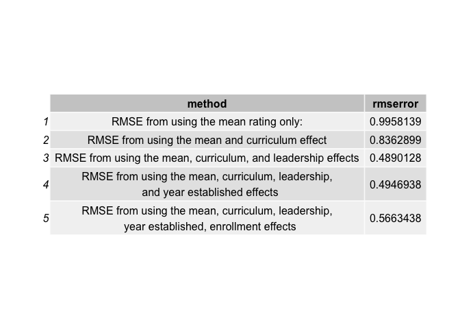

Predicting UAE Schools Inspection Rating
================
Sarah Darwish

## Introduction

This research provides a statistical model for predicting Dubai’s
private schools performance in achieving a rating of “Weak”,
“Acceptable”, “Good”, “Very Good”, or “Outstanding” during the
annual school inspection administered by Dubai’s Knowledge and Human
Development Authority, from published school inspection reports . While
the United Arab Emirates School Inspection Framework rates schools on 44
performance points across six performance standards, our research
suggests that a school rating can be predicted to a great accuracy from
a handful of performance points and by considering other school
characteristics.

We also examine the correlation between the performance points and the
schools’ final rating and study the effects of other aspects of Dubai
private schools, such as curriculum, student enrollment, and the year a
school was founded.

Since the founding of the United Arab Emirates (UAE) in 1971, access to
quality education in the country has steadily improved as the result of
the considerable investment, numerous reforms, and specialized
initiatives. Education has been a high-priority sector for the UAE as
the government recognizes that a strong educational foundation is
necessary for the country to reach its ambition of diversifying and
developing its economy.

**The United Arab Emirates Vision 2021** includes aspirations for
citizenship, a spirit of entrepreneurship, enhanced educational
attainment, and a knowledge-based economy driven by innovation,
research, science and technology. The realisation of these aspirations
requires a world-class education system, that is regularly assessed
through a high-quality evaluation system, to measure reliably the
quality of school performance and to support school improvements and
students’ outcomes, through rigorous and regular school inspections.

## The UAE School Inspection Framework

**The UAE School Inspection Framework** is based on comprehensive
performance standards that define the essential aspects of a quality
education. Each standard is broken down into specific indicators and
elements, and detailed descriptors and illustrations guide inspection
judgements and school improvement. The UAE School Inspection Framework
assesses private schools according to 48 indicators under the following
six *performance standards*:  
1\. Students’ achievement  
2\. Students’ personal and social development, and their innovation
skills  
3\. Teaching and assessment  
4\. Curriculum  
5\. The protection, care, guidance and support of students  
6\. Leadership and management

Schools receive their first inspection during their second year. At the
conclusion of a school inspection, a report is issued to the public,
where a school is conclusively awarded one of the following ratings:  
\* Outstanding  
\* Very Good  
\* Good  
\* Acceptable  
\* Weak

It is important to note, that to-date, a new school has never been
awarded higher than “Good” during their first inspection.

Another important note: As of 2019, *Emirati students must enroll in a
school rated “Acceptable” or “Higher”*. This is in preparation for
tighter restrictions during the academic year 2020-2021, where *Emirati
students will only be allowed to enroll in schools rated “Good” or
higher*.

To take these two important notes in consideration in our prediction
model, our data only includes schools that have been rated at least
twice before the academic year 2018-2019.

## Our Problem Statement

This project aims to solve the problem of training a machine learning
algorithim that reads an input of school information and predicts the
awarded school rating for that academic year.

### Model Evaluation

We evaluate our model using two methods:

#### 1\. Root Mean Square Error

The value used to evaluate the used model’s performance is the Root Mean
Square Error, or RMSE, which measures the accuracy by comparing
forecasting errors of different models for a particular dataset. RMSE is
calculated by taking the root of the mean of the squared distance
between the actual rating and the predicted rating. Therefore, the lower
a RMSE is, the better.

The RMSE can be calculated as shown
below:

\[ RMSE = \sqrt{\frac{1}{N}\displaystyle\sum_{u,i} (\hat{y}_{u,i}-y_{u,i})^{2}} \]

``` r
#RMSE function
RMSE <- function(trueratings, predictedratings){
  sqrt(mean((trueratings-predictedratings)^2))
}
```

#### 2\. Overall Accuracy

We also consider the Overall Accuracy of our model across the five
different classes represented by the five possible school ratings that
can be awarded for an academic year: “Outstanding”, “Very Good”, “Good”,
“Acceptable”, “Weak”.

The overall accuracy meteric is computed as
follows:

\[ Overall Accuracy= \frac{True Positive +True Negative}{True Positive + False Positive + True Negative + False Negative} \]
We also briefly explore other measures such as “Sensitivity” and
“Specificity”, as well as other metrics that helps us understand how
and why do schools get classified into each of the five classes.

### Our Data

In the initial phase of our research, we explore the “open” data
provided by Dubai’s Knowledge and Human Development Authority (KHDA) on
Dubai private schools. We have also attained data from the Dubai School
Inspection Reports for the academic year 2018-2019 -excluding schools
that have not been inspected at least twice before 2018-2019.

This data is combined and provided in several datasets below:

#### The “schools” dataset:

A dataframe that combines all the general school data provided by the
KHDA, as well as, all the 2018-2019 school inspection reports’ results.
This dataframe includes 50 columns described below:

(Col 1) Schoolid: A unique id given to each school  
(Col 2) School.Name: The School’s Name  
(Col 3) r1617 : The School’s overall inspection result for the academic
year 2016-2017 in numerical factors (1= Weak,…,5= Outstanding).  
(Col 4) r1718 : The School’s overall inspection result for the academic
year 2017-2018 in numerical factors.  
(Col 5) r1819 : The School’s overall inspection result for the academic
year 2018-2019 in numerical factors.  
(Col 6 - Col 46) KG2.1 - P6.5: The School’s inspection results in each
of the 14 performance indicators divided under performance standards
2,3,4,5, and 6. For the first four of these performance standards (2-5)
are measured seperately for each school phase (For uniformity purposes,
all schools have been divided into 4 phases labeled as “K.G.”,
“Elementary” (E), “Middle” (M), “High” (H)). All the results are
presented in numerical factors.

(Col 47) location: The Dubai district where the school is related  
(Col 48) curriculum: The curriculum taught by the school  
(Col 49) established: The year the school was established/founded in
Dubai  
(Col 50) enroll1819 : Number of students enrolled during the academic
year 2018-2019

#### Secondary dataset (“dps”)

As we do not intend to use all of the 50 columns in our model, we will
later create a secondary dataset -selecting only the required columns
from the “schools” dataset. We will explain the method in which we have
selected these columns in the “Exploratory Analysis” section.

#### Training, Testing, and Validation datasets

After creating the “dps” dataset, we will partition the data in order to
create a training dataset on which we will train our model, and a
testing dataset to accurately evaluate our progress while we build our
model, and lastly, a validation dataset to accurately and objectively
test the overall performance of our model.

### Cleaning the Data

We first take a glimpse at our dataset, after removing schools that have
not been first inspected in 2016/2017 (While these schools appear as
entries in our dataset, most of their data is missing):

``` r
#reading data from inspection reports
dsib<- read.csv("dsib.csv")
dsib <- dsib %>% as.data.frame
dsib <- dsib %>% mutate(School.Name= as.character(School.Name))

#reading data from Dubai Private Schools Information released by KHDA
schooldata <- read.csv("schooldata.csv")
schooldata <- schooldata %>% select (-(grades)) %>% select(-School.Name)

schools <- left_join(dsib, schooldata, by=c("Schoolid"= "schoolid"))

#Filtering schools which have not been rated twice before 
#(General Information about these schools is not included in our dataset)
schools <- schools %>% filter(!is.na(P6.1) & !is.na(curriculum) )

#Taking a glimpse at our data
schools %>% arrange(curriculum) %>% head
```

    ##   Schoolid                                School.Name r1617 r1718 r1819 KG2.1
    ## 1      118               Lycee Francais International     3     4     4     5
    ## 2      119 Lycee Francais International G. P. Primary     5     5     5     5
    ## 3      120 Lycee Francais International G. P. School      5     5     4     0
    ## 4      121     Lycee Libanais Francophone Prive-Dubai     4     4     4     5
    ## 5       96            INTERNATIONAL CONCEPT EDUCATION     3     3     2     4
    ## 6       85          German International School Dubai     3     3     3     5
    ##   E2.1 M2.1 H2.1 KG2.2 E2.2 M2.2 H2.2 KG2.3 E2.3 M2.3 H2.3 KG3.1 E3.1 M3.1 H3.1
    ## 1    5    5    5     4    4    4    4     4    4    4    4     4    4    4    5
    ## 2   NA   NA   NA     5   NA   NA   NA     5   NA   NA   NA     5   NA   NA   NA
    ## 3    5    4    5     0    5    3    3     0    3    3    4     0    5    5    5
    ## 4    5    5    5     4    4    4    4     4    4    4    4     5    4    4    4
    ## 5    4    4    0     3    3    3    0     3    3    3    0     3    3    3    0
    ## 6    4    4    4     4    3    3    3     3    4    4    4     4    3    3    4
    ##   KG3.2 E3.2 M3.2 H3.2 KG4.1 E4.1 M4.1 H4.1 KG4.2 E4.2 M4.2 H4.2 KG5.1 E5.1
    ## 1     4    3    3    3     5    5    5    5     4    3    3    3     5    5
    ## 2     5   NA   NA   NA     5   NA   NA   NA     5   NA   NA   NA     5   NA
    ## 3     0    4    4    5     0    4    5    4     0    4    3    3     0    5
    ## 4     5    4    4    4     5    4    5    5     5    4    4    4     5    5
    ## 5     2    2    2    0     4    4    4    0     3    3    3    0     4    4
    ## 6     3    3    3    3     4    3    3    3     4    3    3    4     5    5
    ##   M5.1 H5.1 KG5.2 E5.2 M5.2 H5.2 P6.1 P6.2 P6.3 P6.4 P6.5       location
    ## 1    5    5     4    4    3    4    4    4    3    4    4      Oud Metha
    ## 2   NA   NA     5   NA   NA   NA    5    5    5    5    5      Oud Metha
    ## 3    5    5     0    5    5    5    5    4    5    4    5    Al Rowaiyah
    ## 4    5    5     5    5    5    5    5    4    4    4    4 Al Muhaisnah 4
    ## 5    4    0     2    2    2    0    2    2    4    2    4    Meydan City
    ## 6    5    5     4    4    4    4    3    2    3    4    3  Academic City
    ##   curriculum established enroll1819
    ## 1     French        2005       2226
    ## 2     French        2005        267
    ## 3     French        1998       2086
    ## 4     French        2004       1171
    ## 5  French-IB        2013        241
    ## 6     German        2004        793

Note that for the 5th entry, “INTERNATIONAL CONCEPT EDUCATION”, the
curriculum columns states “French-IB”. This is because like many other
schools, International Concept Education is a dual-curriculum school.

We will seperate the data into two columns, “Curriculum” and “Dual”, the
latter will hold any information about a second curriculum a school may
adopt, and will be left empty otherwise.

We can also see that some values are missing: This is because some
schools do not contain all education phases, e.g, “Lycee Francais
International G. P. Primary”, only contains the equivalent of a
Kindergarten phase.

However, while this has caused some of the data to be missing -we will
be replacing all “NA” instances with “0”s, later in our code.

``` r
#splitting dual curriculum school information 
curris <- schools$curriculum %>% str_split("-", simplify=TRUE)
schools <- schools %>% mutate (curriculum= curris[,1], dual= curris[,2])
```

We will also add a column to preserve the “string” rating for each
school.

``` r
#Adding a column and converting from numeric factor to text factor rating
schools <- schools %>% mutate (rating= as.factor(r1819*-1) )

levels(schools$rating) <- c("Outstanding", "Very Good","Good","Acceptable","Weak")
schools$rating <- ordered(schools$rating,
                  levels=c("Outstanding", "Very Good","Good","Acceptable","Weak"))
```

## Exploratory Analysis

In order to create a prediction model for school inspection results, we
must study these results while taking a look at the effects of:  
\* The school curriculum  
\* The effectiveness of the school leadership, and the school’s ability
to self-evaluate  
\* The year a school was founded  
\* The number of enrolled students  
\* The number of “phases”  
\* The safety and wellbeing of the students  
\* The school inspection results of the previous year

#### The Curriculum Effect

We start by taking a look at the distribution of curriculums in our data
and their effect on the school inspection results.

<!-- -->

As we can see, some curriculums are only implemented in less than 5
schools, and therefore, their effect on the school inspection results
are not obvious. To avoid any undesired effects this may have on our
analysis, we shall group these curriculums together in one group called
“Other”.

We regraph the modified curriculum data vs. the school inspection
results.

<!-- -->

This figure helps us identify the distribution of school inspection
results among curriculums. It shows that, for some curriculums, their is
a clear effect. For instance, according to curriculum data alone, it
seems that French schools are likely to be rated higher then Iranian
schools; wherelse, it is harder to discern the effect of British,
American, and Indian curriculums on the inspection results data
-implying that there are other factors at play.

#### The Leadership Effect

In the USIF, school leadership is evaluated in the sixth performance
standard according to five different performance indicators.

However, by exploring the data it becomes clear that two of the five
performance standards are more correlated to the inspection results than
the others.

    ##    corr_6.1  corr_6.2  corr_6.3  corr_6.4  corr_6.5
    ## 1 0.8980187 0.9242131 0.7862128 0.8447702 0.8627163

performance standard 6.1: **Effectiveness of School Leadership** and
performance standard 6.2: **School Self-Evaluation**

We can easily discern the effect of these two performance standards on
the inspection results through the below figure.

<!-- -->

The effects on inspection results seen in the figure can be inferred as
follows:

1.  The majority of schools have the same rating in their overal
    inspection results as they do for Self Evaluation (6.2) (For
    instance, a school who scores “Good” on 6.2, is likely to score
    “Good” in the overall inspection results )  
2.  Most schools have scored a rating on Effectiveness of School
    Leadership (6.1) that is higher or equal to their overall inspection
    results.  
    (A school rated “Good” is most likely to have scored “Good” or “Very
    Good” on 6.2)

### The Year “Established” Effect

An unexpected outcome of studying the data on when schools were first
established/founded (i.e, first year of student enrollement), is
discerning that older schools tend to be rated lower than modern
schools. This can be easily inferred from the below figure.

<!-- -->

Despite the common saying “Old is Gold”, schools that were established
during or before the 1980’s are less likely to be rated “Good” or higher
than schools that have been established during the 90’s or later. In
fact, the figure above clearly shows that during the year 2005, more
schools were established, that are now considered “Outstanding”, than
any other year.

### The School Size Effect

#### Student Enrollement

Our model also takes into consideration several metrics that measure
school size. One measure we take into consideration is the number of
students enrolled in a school.

The figure below shows the number of enrolled students in schools
grouped by rating.

<!-- -->

#### Education Phases

Another metric to take into consideration is the number of educational
phases in a school. For normalization purposes, we disregard the
differences between the adopted curriculum in each school -which divide
the school phases differently. Instead, we consider any K-12 school to
have four phases: - Kindergarten - Elementary - Middle School - High
School

Below we graph the number of phases in a school vs. the number of
students enrolled.

<!-- -->

By observing the figure above, we can see that while the majority of
schools have contain all educational phases, almost all schools that
have only 3 phases or less, are likely to be rated “Good” or higher.

### The Teaching Effect

The first indicator under “Teaching and Assessment”, the third
performance standard in the Unified School Inspection Framework,
evaluates the “Teaching for Effective Learning” in a school. This
performance indicator is evaluated seperately for each education phase.

The following figure shows the effect of the average “Teaching for
Effective Learning” rating of a school inspection results.

<!-- -->

By studying the figure above, it becomes clear that the school
inspection ratings are closely related to how well the school is rated
on Teaching for Effective across the multiple phases in the school.

For instance, “Outstanding” schools, never score a rating less than
“Very Good” on “Teaching for Effective Learning” across all the
phases, where else, “Acceptable” schools never achieve a rating higher
than “Good” across any of their phases.

### Health and Safety Effect

The USIF evaluates the “Schoool Health and Safety, including
arrangements for child protection / safeguarding” through preformance
indicator 5.1, which is measured for each school phase.

The below figure shows the effect of performance indicator 5.1 on the
School Inspection Results.

<!-- -->

From the figure above it is discerned, that while no operating school is
rated “Weak”, “Weak” schools only score a rating of “Acceptable” on
Health and Safety across all school phases. “Good” schools only get a
rating of “Good” or higher on Health and Safety, while “Outstanding”
schools only score a rating of “Outstanding”.

### The Previous School Rating Effect

Lastly, one of a school inspector’s duties is to measure the progress of
a school through an improvement plan based on the previous inspection
results. Therefore, the school’s previous inspection ratings is a
contributing factor to a school’s current inspection result. For this
reason, we have opted to include schools that have been rated at least
twice before 2018-2019. There is also a secondary justification: The
highest rating a school can achieve on its first inspection is “Good”,
and therefore would not reach a rating of “Outstanding” until two years
later.

We can study the trends of school ratings for a school on the following
graph:

<!-- -->

By studying the graph above, we notice that the percentage of schools
whose ratings has changed at least once over the course of 3 years is
around 31%. Therefore, it would be useful to consider the effect of
previous ratings in our prediction model.

On another important note, we also deduce that by studying the number of
schools whose ratings has changed at least once over the course of 3
years, serves to provide us with a reasonable benchmark of accuracy. A
good prediction model would need to exceed the accuracy of merely
assuming a school has retained the same rating over several years.

**Therefore, for it to be useful, our prediction model must be able to
accurately predict the school rating with more than an 69% accuracy. **

#### Data Preparation

Before we build our model, we select the columns to be used from the
“schools” dataframe in a new data frame called “dps”.

We then split the “dps” dataframe into training and test sets in order
to test our model before calculating the RSME on the entire set.

We add a few columns to help calculate the metrics discussed earlier,
that are required to group our data. (See the **Exploratory Analysis**
section)

Lastly, We also will create a function RMSE, to calcuate the root mean
squared error between an actual rating and predicted rating, to be used
in our model.

``` r
#RMSE function
RMSE <- function(trueratings, predictedratings){
  sqrt(mean((trueratings-predictedratings)^2))
}

#Replacing all "NA" with zeros
dps[is.na(dps)] <- 0
dps <- dps %>% mutate(phases=4)
dps$phases<- 4-rowSums(dps[,8:11]==0)

#Calculating different metrics for prediction model 

dps <- dps %>% mutate(
  # Rounding the student enrollment numbers to within 150 students
  enroll= round(enroll1819/150), 
  # Rounding the year a school is established to 3 years 
  E= round(established/3)*3, 
  # Calculating the avg size of an school phase
  phase_size = ceiling((enroll1819/phases)/100)*100, 
  # Calculating avg rating for Teaching for Effective Learning (3.1) across phases
  te_avg= ((KG3.1+ E3.1+ M3.1+ H3.1)/phases), 
  # Calculating avg rating for Health and Safety (5.1) across phases
  safe_avg=(KG5.1+ E5.1+ M5.1+ H5.1)/phases,
  # Calculating avg of 5.1: Effectiveness of School Leadership,
  # and 5.2: School Self-Evaluation
  avg= ((P6.1+ P6.2)/2)) 


#partitioning the data into training, testing, and validation datasets
set.seed(311, sample.kind = "Rounding")
testindex <- createDataPartition(y = dps$r1819, times = 1, p = 0.3, list = FALSE)
train <- dps[-testindex,]
testing <- dps[testindex,]

set.seed(311, sample.kind = "Rounding")
t_index <- createDataPartition(y = testing$r1819, times = 1, p = 0.5, list = FALSE)
test <- testing[-t_index,]
validation  <- testing[t_index,]
```

### Our Model

In our model, we consider the following effects:  
\* The school curriculum  
\* The effectiveness of the school leadership, and the school’s ability
to self-evaluate  
\* The year a school was founded  
\* The number of enrolled students  
\* The number of “phases”  
\* The safety and wellbeing of the students  
\* The school inspection results of the previous year

To better evaluate the changes in RMSE, we will start by calculating the
RMSE for using the average rating.

``` r
  #Average school rating
  mu <- mean(train$r1819)
test <- test %>% mutate(predicted= mu)
method<- c("")
rmserror<- 0

errors <- data.frame(method, rmserror, stringsAsFactors = FALSE)
errors <- errors %>%
  mutate(method= c("RMSE from using the mean rating only:"),
                             rmserror= RMSE(test$r1819, test$predicted))
  grid.table(errors)
```

<!-- -->

We can see that there is much room for improvement. We first start by
grouping schools according to their curriculum of study, and measuring
the curriculum bias -by subtracting the mean rating from the average
rating of each group. We then calculate the RMSE to evaluate the model.

``` r
#The curriculum effect

#calculating mean of curriculum
curriculumbias <- train  %>% group_by(curriculum) %>%
  summarize(b_curr = mean(r1819- mu))

train <- train %>% left_join(curriculumbias)

test<- test %>% left_join(curriculumbias)%>%
  mutate(predicted= mu+b_curr)

dualbias <- train %>% group_by(dual) %>%
  summarize (b_dual= mean(r1819- mu - b_curr))
train <- train %>% left_join(dualbias)
test <- test %>% left_join(dualbias) %>% mutate(predicted= mu + b_curr + b_dual)

errors <- errors %>% 
  add_row(method= c("RMSE from using the mean and curriculum effect"),
                             rmserror= RMSE(test$r1819, test$predicted))
grid.table(errors)
```

<!-- -->

While this greatly reduced the error, we continue to improve our model.

The next step to reduce the error in our model is by grouping schools
according the Leadership effect bias, by taking the average of
performance indicators 6.1 and 6.2: Effectiveness of School Leadership,
and School Self-Evaluation, respectively.

``` r
#calculating Leadership effects
#SEF effect
SEFbias <- train  %>%
   group_by (avg) %>%
  summarize(b_l = mean(r1819 - mu - b_curr - b_dual))

train <- train %>% left_join(SEFbias)

test <- test %>% left_join(SEFbias)%>%
  mutate(predicted= mu + b_curr + b_dual + b_l)

errors <- errors %>% 
  add_row(method= c("RMSE from using the mean, curriculum, and leadership effects"),
     rmserror= RMSE(test$r1819, test$predicted))

  grid.table(errors)
```

<!-- -->

We can see that this reduces the error further than when using only the
mean rating in our prediction model.

We further improve our model by adding the “Year established” effect
bias, through the code below:

``` r
#Year school was established effect
establishedbias <- train  %>% group_by(E) %>% 
  summarize(b_est = mean(r1819- mu- b_curr- b_dual - b_l))
train <- train %>% left_join (establishedbias)
test <- test %>% left_join(establishedbias) %>% 
  mutate(predicted= mu + b_curr + b_dual +b_l+ b_est) 

#fail safe against data partition
test$b_est[is.na(test$predicted)] <- 0
test <- test %>% mutate (predicted= mu + b_curr + b_dual +b_l+ b_est )
test$predicted[which(test$predicted>5)] <- 5

errors <- errors %>% add_row(
  method= c(
  "RMSE from using the mean, curriculum, leadership,
  and year established effects"),
  rmserror= RMSE(test$r1819, test$predicted))
grid.table(errors)
```

<!-- -->

While it appears that this increases the error rather than decrease it,
this is actually due to the lack of regularization. This effect is
common when schools are not divided evenly between groups, i.e, the
number of schools in a group is much larger than an other. This effect
also appears when we consider the effect of student enrollment on the
school inspection rating.

``` r
#Enrollment effect
enrollbias <- train %>%
  group_by(enroll) %>%
  summarize(b_en = mean(r1819- mu - b_curr - b_dual- b_l - b_est))
train <- train %>% left_join(enrollbias)

test <- test %>% left_join(enrollbias) %>%
  mutate(predicted= mu+b_curr+ b_dual + b_l + b_est+ b_en) 
test$b_en[is.na(test$predicted)] <- 0
test <- test %>% 
  mutate(predicted= mu+b_curr+ b_dual + b_l + b_est+ b_en)
test$predicted[which(test$predicted>5)] <- 5

errors <- errors %>% add_row(method= c(
  "RMSE from using the mean, curriculum, leadership,
  year established, enrollment effects"),
   rmserror= RMSE(test$r1819, test$predicted))
grid.table(errors)
```

<!-- -->

Again, the RMSE seems to increase once more when we consider the effect
of student enrollment. **This will be remedied once we introduce
regularization into our model, which would penalize smaller groups that
could skew the accuracy of our model** We then add the “Teaching for
Effective Learning” effect bias, by taking the average score across all
phases.

``` r
#Teaching effect

teachingbias <- train %>% group_by(te_avg)%>%
 summarize(b_te= mean(r1819- mu - b_curr- b_dual -b_l-
                        b_est-b_en))
train <- train %>% left_join(teachingbias)

test <- test %>% left_join(teachingbias)%>%
  mutate(predicted= mu + b_curr + b_dual + b_l +
           b_est + b_en + b_te) 
test$b_te[is.na(test$predicted)] <- 0
test <- test %>% mutate(predicted= mu + b_curr + b_dual + b_l +
                          b_est + b_en + b_te) 
test$predicted[which(test$predicted>5)] <- 5
errors <- errors %>% add_row(method= c(
  "RMSE from using the mean, curriculum, leadership,
  year established, enrollment, teaching effects"),
                             rmserror= RMSE(test$r1819, test$predicted))
grid.table(errors)
```

<!-- -->

While the RMSE of our model has been decreased remarkably, we can
further improve our model by adding the effect of school size. We
achieve this by grouping schools by phase size (average number of
student in phase), and the number of education phases in the school.

``` r
#School size effect
sizebias <- train %>% group_by(phases,phase_size) %>% 
  summarize(b_ss=mean(r1819 - mu - b_curr - b_dual - b_l -
                        b_est - b_en - b_te))
train <- train %>% left_join(sizebias)

test <- test %>% left_join(sizebias) %>%
  mutate(predicted= mu + b_curr + b_dual + b_l +
           b_est + b_en + b_te + b_ss) 
test$b_ss[is.na(test$predicted)] <- 0
test <- test %>% 
  mutate(predicted= mu + b_curr + b_dual + b_l +
           b_est + b_en + b_te + b_ss) 

test$predicted[which(test$predicted>5)] <- 5

errors <- errors %>% add_row(method= c(
  "RMSE from using the mean, curriculum, leadership,
  year established, enrollment, teaching,
  school size effects"),
    rmserror= RMSE(test$r1819, test$predicted))
grid.table(errors)
```

<!-- -->

We notice that the RMSE has now been reduced to about half by taking
into consideration the effects mentioned in the table above, we can
still improve our model by taking into consideration another USIF
performance indicator: 5.1 Health and Safety, including provision of
child protection and safeguarding. The effect can be discerned by the
table below:

``` r
#The Safety bias
safetybias <- train %>% group_by(safe_avg) %>% 
 summarize(b_safe= mean(r1819- mu -b_curr -b_dual -b_l -b_est -b_en -b_te -b_ss))
train <- train %>% left_join(safetybias)

test <- test %>% left_join(safetybias) %>%
  mutate(predicted= mu +b_curr +b_dual +b_l +b_est +b_en +b_te +b_ss +b_safe) 

#failsafe against data partitioning
test$b_safe[is.na(test$predicted)] <- 0
test <- test %>% 
  mutate(predicted= mu + b_curr + b_dual + b_l + b_est + b_en + b_te + b_ss + b_safe) 
test$predicted[which(test$predicted>5)] <- 5

errors <- errors %>%
  add_row(method= c(
    "RMSE from using the mean, curriculum, leadership,
    year established, enrollment, teaching,
    school size, safety effects"),
    rmserror= RMSE(test$r1819, test$predicted))

grid.table(errors)
```

<!-- -->

Lastly, we further reduce the RMSE error by considering the effect of
previous inspection ratings, during the academic years 2016-2017 and
2017-2018.

``` r
#Previous rating bias 
prevbias <- train %>% group_by(r1617, r1718) %>% 
  summarize(b_prev= mean(r1819 -mu -b_curr -b_dual -b_l -b_est -b_en -b_te -b_ss -b_safe))

train <- train %>% left_join(prevbias)

test <- test %>% left_join(prevbias)%>%
  mutate(predicted= mu +b_curr +b_dual +b_l +b_est +b_en +b_te +b_ss +b_safe +b_prev) 

test$b_prev[is.na(test$predicted)] <- 0

test <- test %>% 
  mutate(predicted= mu +b_curr +b_dual +b_l +b_est +b_en +b_te +b_ss +b_safe +b_prev)
test$predicted[which(test$predicted>5)] <- 5

errors <- errors %>% add_row(method= c(
    "RMSE from using the mean, curriculum, leadership,
    year established, enrollment, teaching,
    school size, safety, previous rating effects"),
    rmserror= RMSE(test$r1819, test$predicted))

grid.table(errors)
```

<!-- -->

## Results

Although we have decreased the RMSE remarkably, we can still improve
upon our results by regularization.

In order to tune the regulization factor, lambda, we will try different
values between 0 and 5, and use the value that yields the lowest RMSE.

``` r
 #resetting trainset 
 train <- dps[-testindex,] 
 
 regularized <- function(lambda)
 {
   mu <- mean( train$r1819)
   
   curriculumbias <- train  %>% group_by(curriculum) %>% 
     summarize(b_curr= sum(r1819- mu)/(n()+lambda))
   train <- train %>% left_join(curriculumbias)
   
   dualbias <- train %>% group_by(dual) %>%
     summarize(b_dual= sum(r1819- mu -b_curr)/(n()+lambda))
   train <- train %>% left_join(dualbias)
   
   SEFbias <- train   %>% group_by (avg) %>% 
     summarize(b_l= sum(r1819- mu- b_curr -b_dual)/(n()+lambda))
   train <- train %>% left_join(SEFbias)
   
   establishedbias <- train %>% group_by(E) %>%
     summarize(b_est= sum(r1819- mu -b_curr -b_dual -b_l)/(n()+lambda))
   train <- train %>% left_join(establishedbias)
   
   enrollbias <- train %>% group_by(enroll) %>% 
     summarize(b_en= sum(r1819- mu -b_curr -b_dual -b_l -
                           b_est)/(n()+lambda))
   train <- train %>% left_join(enrollbias)
 
   teachingbias <- train %>% group_by(te_avg) %>% 
     summarize(b_te= sum(r1819- mu -b_curr -b_dual -b_l -
                           b_est -b_en)/(n()+lambda))
   train <- train %>% left_join(teachingbias)
   
   sizebias <- train %>% group_by(phases,phase_size) %>% 
     summarize(b_ss= sum(r1819- mu -b_curr -b_dual -b_l -
                           b_est -b_en -b_te)/(n()+lambda))
   train <- train %>% left_join(sizebias)
   
   safetybias <- train %>% group_by(safe_avg) %>% 
     summarize(b_safe= sum(r1819- mu -b_curr -b_dual -b_l -
                             b_est -b_en -b_te -b_ss)/(n()+lambda))
   train <- train %>% left_join(safetybias)
   
   prevbias <- train %>% group_by(r1617, r1718) %>% 
     summarize(b_prev=sum(r1819- mu -b_curr -b_dual -b_l -
                            b_est -b_en -b_te -b_ss -b_safe)/(n()+lambda))
   train <- train %>% left_join(prevbias)
   
   train <- train %>% mutate(predicted= mu+b_curr +b_dual +
                               b_l+b_est+b_en+b_te+b_ss+b_safe+b_prev)
   train$predicted[which(train$predicted>5)] <- 5
   
   RMSE(train$r1819, train$predicted)
   }
 
 lambdas <- seq(0,5,0.01)
 rmses <- sapply(lambdas, regularized)
 
 qplot(lambdas, rmses)
```

<!-- -->

``` r
 lambda <- lambdas[which.min(rmses)]
```

``` r
print("Minimum RMSE using training dataset: ")
```

    ## [1] "Minimum RMSE using training dataset: "

``` r
min(rmses)
```

    ## [1] 0.2489185

``` r
#Using best lambda
curriculumbias <- train  %>% group_by(curriculum) %>% 
  summarize(b_curr= sum(r1819- mu)/(n()+lambda))
train <- train %>% left_join(curriculumbias)

dualbias <- train %>% group_by(dual) %>%
  summarize(b_dual= sum(r1819- mu -b_curr)/(n()+lambda))
train <- train %>% left_join(dualbias)

SEFbias <- train   %>% group_by (avg) %>% 
  summarize(b_l= sum(r1819- mu- b_curr -b_dual)/(n()+lambda))
train <- train %>% left_join(SEFbias)

establishedbias <- train %>% group_by(E) %>%
  summarize(b_est= sum(r1819- mu -b_curr -b_dual -b_l)/(n()+lambda))
train <- train %>% left_join(establishedbias)

enrollbias <- train %>% group_by(enroll) %>% 
  summarize(b_en= sum(r1819- mu -b_curr -b_dual -b_l -
                        b_est)/(n()+lambda))
train <- train %>% left_join(enrollbias)

teachingbias <- train %>% group_by(te_avg) %>% 
  summarize(b_te= sum(r1819- mu -b_curr -b_dual -b_l -
                        b_est -b_en)/(n()+lambda))
train <- train %>% left_join(teachingbias)

sizebias <- train %>% group_by(phases,phase_size) %>% 
  summarize(b_ss= sum(r1819- mu -b_curr -b_dual -b_l -
                        b_est -b_en -b_te)/(n()+lambda))
train <- train %>% left_join(sizebias)

safetybias <- train %>% group_by(safe_avg) %>% 
  summarize(b_safe= sum(r1819- mu -b_curr -b_dual -b_l -
                          b_est -b_en -b_te -b_ss)/(n()+lambda))
train <- train %>% left_join(safetybias)

prevbias <- train %>% group_by(r1617, r1718) %>% 
  summarize(b_prev=sum(r1819- mu -b_curr -b_dual -b_l -b_est -b_en -b_te -b_ss -b_safe)/(n()+lambda))
train <- train %>% left_join(prevbias)

train <- train %>% mutate(predicted= mu+b_curr +b_dual +b_l+b_est+b_en+b_te+b_ss+b_safe+b_prev)
train$predicted[which(train$predicted>5)] <- 5

#Evaluating our model using regularization on testing dataset
test <- testing[-t_index,]

test <- test %>%
     left_join(curriculumbias) %>% left_join(dualbias) %>%
     left_join(SEFbias) %>% left_join(establishedbias) %>%
     left_join(enrollbias) %>% left_join(teachingbias)%>%
    left_join(sizebias) %>% left_join(safetybias) %>% left_join(prevbias) %>%
  mutate(predicted= mu +b_curr +b_dual +b_l +b_est +b_en +
           b_te +b_ss +b_safe +b_prev)

#fail safe against data partitioning
test[is.na(test)] <- 0
test <- test %>% mutate(predicted= mu +b_curr +b_dual +b_l +b_est +
                          b_en +b_te +b_ss +b_safe +b_prev)
test$predicted[which(test$predicted>5)] <- 5

errors <- errors %>% add_row(method= c(
  "RMSE from using the mean, curriculum, leadership,
  and year established, enrollment, teaching,
  school size, safety, previous rating\n effects with regularization"),
  rmserror= RMSE(test$r1819, test$predicted))
grid.table(errors)
```

<!-- -->

Finally, we evaluate our model on our validation dataset.

``` r
final <- validation%>% 
  left_join(curriculumbias) %>% left_join (dualbias) %>%
  left_join(SEFbias) %>% left_join(establishedbias) %>%
  left_join(enrollbias) %>% left_join(teachingbias) %>%
  left_join(sizebias) %>% left_join(safetybias) %>% left_join(prevbias)

final <- final %>% mutate(predicted= mu+b_curr +b_dual+
                            b_l+b_est+b_en+b_te+b_ss+b_safe+b_prev) 
final$predicted[which(final$predicted>5)] <- 5


final$b_est[is.na(final$predicted)] <- 0
final$b_en[is.na(final$predicted)] <- 0
final$b_te[is.na(final$predicted)] <- 0
final$b_ss[is.na(final$predicted)] <- 0
final$b_safe[is.na(final$predicted)] <- 0
final$b_prev[is.na(final$predicted)] <- 0
  
final <- final %>% mutate(predicted= mu + b_curr + b_l + b_est +
                            b_en + b_te + b_ss + b_safe + b_prev) 
final$predicted[which(final$predicted>5)] <- 5

errors <- errors %>% add_row(method= c(
  "RMSE from evaluating our model using the validation dataset"),
  rmserror= RMSE(final$r1819, final$predicted))

grid.table(errors)
```

<!-- -->

We can see that our model yields exceedingly promising results, by
reducing the RMSE error to approximately 0.308 from the RMSE error
obtained by merely using the average school rating of almost 1.000. The
following shows the confusion matrix among the different school ratings
(showing “Class: 1” to be “Weak”, and “Class:5” as “Outstanding”).

**The confusion matrix demonstrates, that the most difficult rating to
predict is that of “Acceptable”, implying that schools that acquire a
rating of “Acceptable” do not conform to our model’s set of biases in
the manner that other classes do. **

    ## Confusion Matrix and Statistics
    ## 
    ##           Reference
    ## Prediction 1 2 3 4 5
    ##          1 2 2 0 0 0
    ##          2 0 4 1 0 0
    ##          3 0 0 9 0 0
    ##          4 0 0 0 4 0
    ##          5 0 0 0 0 3
    ## 
    ## Overall Statistics
    ##                                           
    ##                Accuracy : 0.88            
    ##                  95% CI : (0.6878, 0.9745)
    ##     No Information Rate : 0.4             
    ##     P-Value [Acc > NIR] : 9.543e-07       
    ##                                           
    ##                   Kappa : 0.8411          
    ##                                           
    ##  Mcnemar's Test P-Value : NA              
    ## 
    ## Statistics by Class:
    ## 
    ##                      Class: 1 Class: 2 Class: 3 Class: 4 Class: 5
    ## Sensitivity            1.0000   0.6667   0.9000     1.00     1.00
    ## Specificity            0.9130   0.9474   1.0000     1.00     1.00
    ## Pos Pred Value         0.5000   0.8000   1.0000     1.00     1.00
    ## Neg Pred Value         1.0000   0.9000   0.9375     1.00     1.00
    ## Prevalence             0.0800   0.2400   0.4000     0.16     0.12
    ## Detection Rate         0.0800   0.1600   0.3600     0.16     0.12
    ## Detection Prevalence   0.1600   0.2000   0.3600     0.16     0.12
    ## Balanced Accuracy      0.9565   0.8070   0.9500     1.00     1.00

## Conclusion

Our model attempts to predict Dubai private schools’ inspection ratings
of “Weak”, “Acceptable”, “Good”, “Very Good”, and “Outstanding” for the
academic year 2018-2019.

Our model yields the best performance, i.e, lowest RMSE, when taking
into consideration the effects of: School curriculum, effectiveness of
school leadership, year the school was established, student enrollment,
teaching for effective learning, school size, health and safety
measures, and previous ratings for the school.

The model can predict school ratings of “Weak”, “Good”, “Very Good”, and
“Outstanding” with a balanced accuracy of 95% or higher. Considering
that these ratings are the result of school inspection evaluation
against the 48 performance indicators in the USIF, we can conclude that,
while there is room for improvement, the accuracy obtained through
studying the biases of the aformentioned 9 effects is quite impressive.
We postulate that, with further research, our work can help school
leadership, education advancement companies, governing bodies, and
various other stakeholders better develop their schools.

**Our suggestion is that by studying the effects evaluated in our model,
and considering their biases in achieving certain ratings, schools could
strategize their school improvement/development plans towards achieving
better school inspection results.**

## Limitations and Future Work

In buidling our datasets and model, our work was restricted by several
limitations that can be included in future work:

1.  Reading data from the School Inspection Reports: Unfortunately, all
    school inspection reports were in a pdf form that could not be
    extracted through “R”. This conclusion was reached after testing
    many different packages on pdf table extraction. This added several
    complexities while gathering our data, and made it difficulut to
    extend our studies to school inspeciton reports published before and
    after 2018-2019 -which could potentially reveal trends that would
    help improve the accuracy of our current model.

2.  Deciding which performance indicators/general school data to use in
    our model: Though we do not show this in our report, several random
    forest simulations were utilized to determine which performance
    indicators were of the most importance in predicting school
    inspection results.

3.  Nonhomogeneity of educational data across different educational
    curriculum: Different curriculums divided educational phases
    differently. For instance, American curriculum schools adopted the
    following educational phases: Kindergarten, Elementary, Middle, and
    High Schools -while British curriculum schools divided its phases
    across Early Years Foundation, Primary, Secondary, and Post-16.
    However, these four phases across both curriculums, did not
    represent the same age group among students. This complicaiton
    extended to other curriculums in our data, and was resolved by only
    considering the data related to phases that are included in the
    “K-12” definition utilized by the KHDA, while coercing uniformity
    in our data. This however, can lead to inconsistencies, since by
    eleminating certain phases that do not conform to the K-12
    definition -we also erase effects that contributed to the schools
    overall rating, which may cause inaccuracies in our predictions.

Another issue that deals with the nonhomogenity of educational data, is
the first performance standard in the USIF which measures Student
Achievement. While we assume that achievement and attainment results of
a schools’ students would be highly coorelated with the schools
inspection ratings, we face major difficulties in utilizing this data,
as different school curriculums focus on different subjects.

We hope to include a summarizing heuristic that would allow us to,
homogenously, evaluate students’ achievement across different
curriculums, and to include the biases of that effect in our model. We
postulate that including this effect in our model would greatly increase
the accuracy of our predictions.
